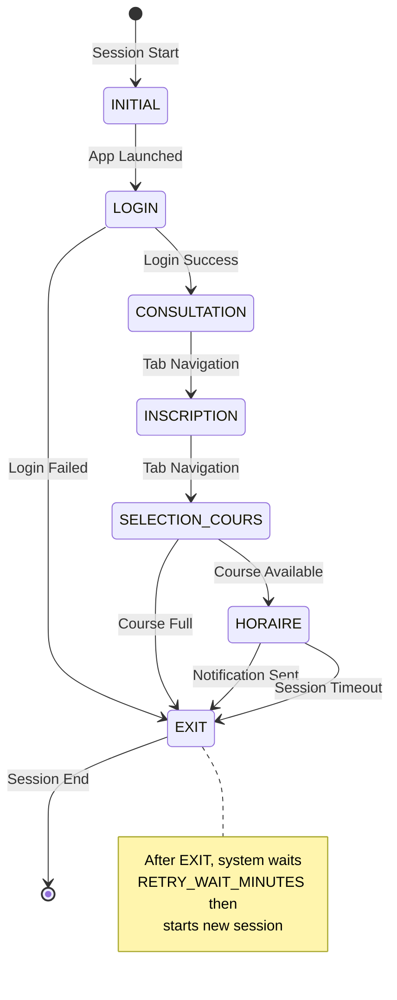

# ChemiNotify State System Documentation

## Overview

ChemiNotify uses a finite state machine to automate course registration monitoring. The application transitions through different states based on the current screen/window state of the ChemiNot application.

## State Machine Architecture

### Core Components

- **StateManager**: Manages state transitions and session timeouts
- **AppState**: Abstract base class for all states
- **StateType**: Enum defining all possible states
- **State Classes**: Individual implementations for each state

### State Flow Diagram

## State Types

| State | Purpose | Next State(s) |
|-------|---------|---------------|
| `INITIAL` | App startup and cleanup | `LOGIN` |
| `LOGIN` | User authentication | `CONSULTATION`, `EXIT` |
| `CONSULTATION` | Navigate to consultation screen | `INSCRIPTION` |
| `INSCRIPTION` | Navigate to inscription session | `SELECTION_COURS` |
| `SELECTION_COURS` | Select target course | `HORAIRE`, `EXIT` |
| `HORAIRE` | Check course availability | `EXIT` |
| `EXIT` | Clean shutdown and restart | Session ends |

## Detailed State Descriptions

### 1. INITIAL State

**Purpose**: Clean startup and application launch

**Key Environment Variables**:
- `CHEMINOT_FILE_PATH`: Path to the JNLP file

**Next State**: `LOGIN` (if successful)

---

### 2. LOGIN State

**Purpose**: Authenticate user credentials

**Detection**: Looks for windows matching `LOGIN_TITLE_BAR` patterns

**Actions**:
- Focuses login window
- Loads credentials from environment variables
- Fills username and password fields
- Handles login button click with popup detection
- Manages session selection popups

**Key Environment Variables**:
- `CHEMINOT_USERNAME`: Login username
- `CHEMINOT_PASSWORD`: Login password

**Next State**: `CONSULTATION` (success) or `EXIT` (failure)

---

### 3. CONSULTATION State

**Purpose**: Navigate to the consultation tab

**Detection**: Checks if "CONSULTATION" tab is active by pixel color matching

**Actions**:
- Focuses "Le ChemiNot" window
- Clicks on "INSCRIPTION_SESSION" tab

**Next State**: `INSCRIPTION`

---

### 4. INSCRIPTION State

**Purpose**: Navigate to course selection

**Detection**: Checks if "INSCRIPTION_SESSION" tab is active by color

**Actions**:
- Focuses main window
- Clicks "SELECTION_COURS" tab with popup detection
- Handles any popups that appear during navigation

**Next State**: `SELECTION_COURS`

**Features**:
- Uses `PopupDetector` for automatic popup handling
- Handles session selection dialogs

---

### 5. SELECTION_COURS State

**Purpose**: Select the target course to monitor

**Detection**: Checks if "SELECTION_COURS" tab is active

**Actions**:
- Switches to course selection tab
- Gets the target course from the env variable
- Clicks on the specified course button
- Analyzes popup responses using OCR
- Determines if course is full or available

**Next States**:
- `HORAIRE`: Course clicked successfully
- `EXIT`: Course is full (triggers wait and restart)

**Key Environment Variables**:
- `TRACKING_COURSE_CODE`: Course code to monitor (default: "GTI611")
- `RETRY_WAIT_MINUTES`: Wait time when course is full (default: 15)

**Popup Analysis**:
- Uses OCR to read popup text
- Detects "complets" or "annulations" for full courses
- Takes debug screenshots for unrecognized popups

---

### 6. HORAIRE State

**Purpose**: Check actual course availability

---
### 7. EXIT State

**Purpose**: Clean application shutdown

**Detection**: Always returns `False` (terminal state)

**Actions**:
- Clicks "QUITTER" button in ChemiNot
- Closes login window with Alt+F4
- Logs session termination

**Next State**: `EXIT` (ends session)
